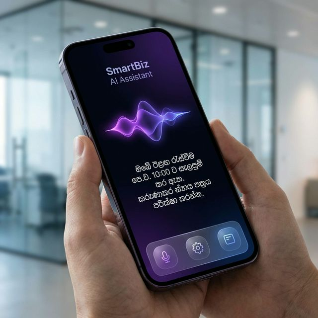
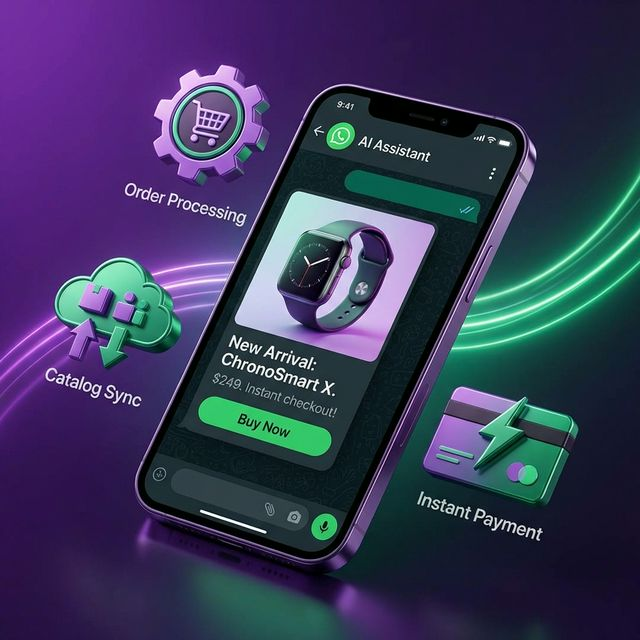
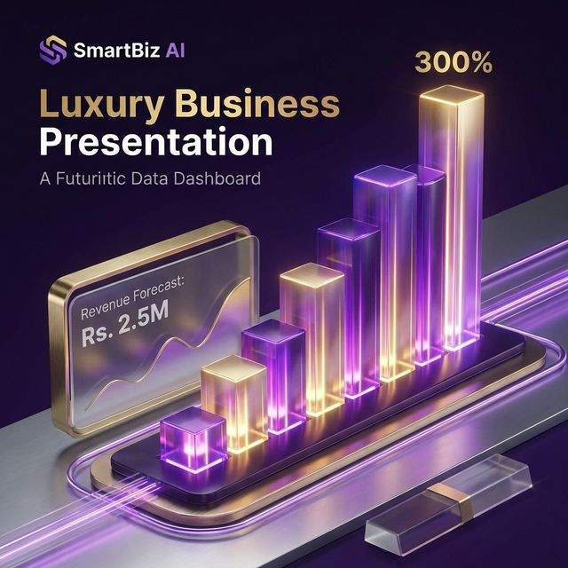

# 🚀 SmartBiz AI Connect: Full System Proposal

**Prepared by:** Creative LabX  
**Date:** February 14, 2026  
**Client:** Business Growth Partnership  

---

> **Experience the Future:** [Access Interactive Visual Presentation](/presentation)

---

## 1. Executive Summary

SmartBiz AI Connect is a revolutionary **Multimodal Intelligence Engine** designed to replace traditional, static chatbots with a dynamic, autonomous digital employee. This system is engineered to handle Sales, Support, and Operations simultaneously across multiple channels, ensuring your business never misses a revenue opportunity.

---

## 2. Omnichannel Strategy: The Triple-Threat

We dominate the customer journey by being present exactly where the customer is—whether they are talking, typing, or sending photos.

### 2.1. Sinhala AI Voice Agent
The system handles incoming phone calls with localized intelligence, understanding Sinhala and Singlish dialects perfectly. It can quote prices, check live stock, and record orders without human intervention.

Figure 1: The AI Voice Agent interface managing real-time customer calls.

*   **Benefit:** 24/7 phone support without hiring staff.
*   **Key Tech:** Deep NLP tuned for Sri Lankan accents.

---

### 2.2. WhatsApp & Telegram Sales Engine
Transform your social media channels into a high-performance retail store. The AI manages the entire sales funnel—from product discovery to payment link generation.

Figure 2: Automated sales flow from chat greeting to order confirmation.

*   **Benefit:** Reduces friction by allowing orders directly inside the chat app.
*   **Key Tech:** Real-time Catalog Integration & Cart Management.

---

### 2.3. AI Visual Search (Vison Intelligence)
Allow customers to search your store by simply uploading a photo. If they see a product they like, they snap a picture, and our AI identifies the closest match in your inventory instantly.

Figure 3: Multimodal Vision system identifying products from user uploads.

*   **Benefit:** Eliminates the need for customers to type complex search queries.
*   **Key Tech:** Computer Vision & Image Embedding.

---

## 3. The "SmartBiz Brain": Advanced Logic

Beyond simple replies, the system is equipped with **Autonomous Action** capabilities.

### 3.1. Independent Task Handling
The AI has "hands"—it doesn't just talk; it performs tasks like checking stock levels, calculating delivery fees, and updating your central database.

### 3.2. Smart Human Handoff
The system is intelligent enough to know its limits. When a "VIP" client is detected or a high-value order is being negotiated, it instantly notifies you to step in and close the deal.

---

## 4. Operational Control: Predictive Command Center

Owners get a futuristic dashboard to monitor AI performance and business health in real-time.

Figure 4: The Predictive Command Center showing revenue forecasts and AI logs.

| Feature | Business Impact |
| :--- | :--- |
| **Revenue Forecasts** | Predictive models for inventory planning. |
| **VIP Identifier** | Automatic tagging of high-spending customers. |
| **Real-Time Logs** | Complete transparency of every AI interaction. |

---

## 5. Pricing & Investment

| Package | Multiplier | Price |
| :--- | :--- | :--- |
| **Growth** | WhatsApp + Basic Analytics | **Rs. 8,500 / mo** |
| **Professional** | Full Triple-Threat (Voice + Vision) | **Rs. 25,000 / mo** |
| **Enterprise** | Custom API & ERP Integration | **Contact Us** |

---

## 6. Conclusion
SmartBiz AI Connect is not just software; it is a **competitive moat**. By automating the "labor-heavy" parts of retail, you free up your time to focus on scaling and strategy.

**Creative LabX**  
*The Future of Retail Intelligence.*
